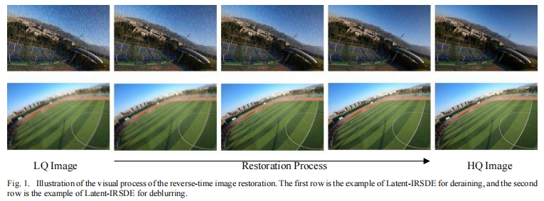
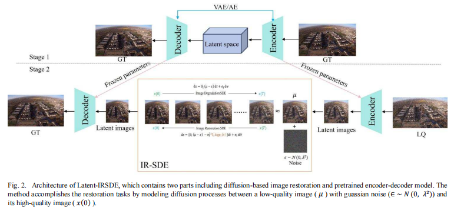
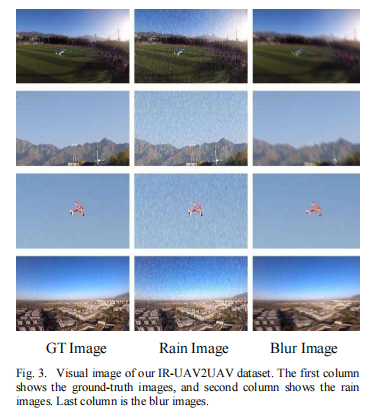
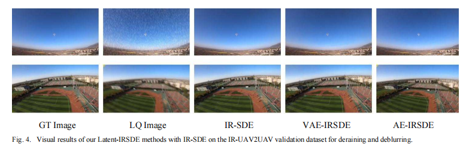
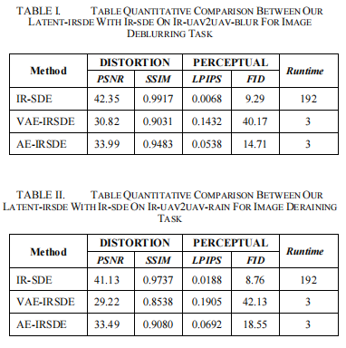

# Latent-IRSDE
<p align="center">

  <h1 align="center">High-Resolution Aerial Image Restoration with Latent Diffusion Models</h1>


  <p align="center">
    <a href="https://github.com/hapless19" rel="external nofollow noopener" target="_blank"><strong>Yong Wang</strong></a>
    ·
    <a href="https://github.com/liw11111" rel="external nofollow noopener" target="_blank"><strong>Wei Li</strong></a>
    ·

  </p>
<p align="center">
    <a href="" rel="external nofollow noopener" target="_blank">2024 IEEE International Conference on Unmanned Systems (ICUS)</a>
  <p align="center">
    
  <p align="center">
<p align="center" style="font-size: 18px; color: gray;">
    Fig. 1. Fig. 1.	Illustration of the visual process of the reverse-time image restoration. The first row is the example of Latent-IRSDE for deraining, and the second row is the example of Latent-IRSDE for deblurring.
</p>
<p align="center">
    
</p>
<p align="center" style="font-size: 18px; color: gray;">
    Fig. 2. Architecture of Latent-IRSDE, which contains two parts including diffusion-based image restoration and pretrained encoder-decoder model. The method accomplishes the restoration tasks by modeling diffusion processes between a low-quality image ( μ ) with guassian noise (∈~ N (0,λ^2)) and its high-quality image (x(0)).
</p>

## **Abstract** 📝
This paper aims to improve the performance of diffusion models in high-resolution unmanned aerial vehicle (UAV) aerial image restoration tasks. We propose an efficient image restoration algorithm based on diffusion models, named Latent-IRSDE, which consists of two parts: pretrained encoder-decoder networks and diffusion-based image restoration networks. Diffusion-based image restoration networks have the remarkable ability to generate high-quality aerial images with low-quality visions. Pretrained encoder-decoder networks transform high-resolution aerial images into small latent images. We leverage the frozen internal representations of pretrained encoder-decoder networks to perform an efficient high-resolution aerial images restoration. We select some data from an open-source dataset to create our IR-UAV2UAV dataset for evaluating our method. The experiments show that our proposed method can restore high-resolution aerial images and achieve fastest inference time in quantitative comparisons of image deblurring and deraining tasks on IR-UAV2UAV dataset with images sized at 1920×1080 pixels.

---


---

## Table of Contents 📑
- [Introduction](#introduction)
- [Contributions](#contributions)
- [Experimental Results](#experimental-results)
- [Visualizations](#visualizations)
- [Reproduction](#reproduction)
- [Citation](#citation)

---

## **Introduction** 🌟

UAV aerial images often suffer from degradation such as motion blur and rain streaks in real scenarios.
Standard diffusion models deliver high-quality generation but are slow for high-resolution images.
Latent Diffusion Models (LDM) enable efficient high-resolution synthesis by working in a compressed latent space, which is suitable for aerial image restoration.

---

## **Contributions** ✨

Applies latent diffusion to high-resolution UAV image restoration for the first time.
Uses frozen pretrained autoencoders to boost efficiency without changing the diffusion structure.
Achieves state-of-the-art inference speed on deblurring and deraining tasks for 1080p aerial images.

---

## **Quick View** 📊
### Dataset Examples
#### Visual image of our IR-UAV2UAV dataset. The first column shows the ground-truth images, and second column shows the rain images. Last column is the blur images.
<p align="center">
    
</p>


## **Experimental Results**🖼️
### Visual results of our Latent-IRSDE methods with IR-SDE on the IR-UAV2UAV validation dataset for deraining and deblurring.
<p align="center">
    
</p>

### Table quantitative comparison between our latent-IRSDE with IR-SDE on IR-UAV2UAV
<p align="center">
    
</p>


---

## **Quick Start** 🚀

### Dataset
- **IR-UAV2UAV**: [Baidu Drive (mt2h)](https://pan.baidu.com/s/1w59YcuoDV_X7bq23Yo2Tew)  


---

## **Citation** 📚

If you find **latent-IRSDE** helpful in your research, please consider citing:
```bibtex
@INPROCEEDINGS{10840082,
  author={Li, Wei and Li, Chengwei and Jiang, Hongqian and Wang, Yong and Wu, Shunan and Wu, Zhigang},
  booktitle={2024 IEEE International Conference on Unmanned Systems (ICUS)}, 
  title={High-Resolution Aerial Image Restoration with Latent Diffusion Models}, 
  year={2024},
  volume={},
  number={},
  pages={1874-1878},
  keywords={Autonomous systems;Transforms;Diffusion models;Autonomous aerial vehicles;Image restoration;UAV;high-resolution image restoration;diffusion model;AutoEncoder},
  doi={10.1109/ICUS61736.2024.10840082}}
```

---
